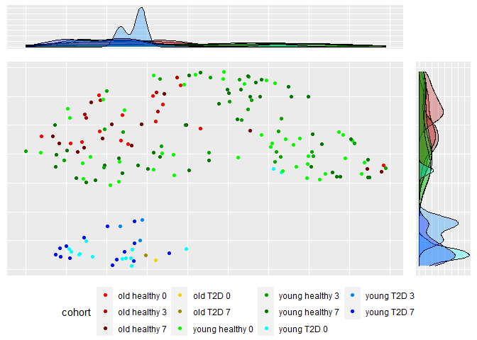

# 1 Read in data from ImmuneSpace via ImmuneSpaceR
First, we will import the necessary libraries using pacman, read in the data from SDY1119 from ImmuneSpace (accession GSE74816) concerning the TIV 2011 vaccination, and extract the gene expression information into a list of matrices. 


```r
#check for pacman, then use it to load/install the rest of the packages
if(!require(pacman)){
    install.packages("pacman")
    library(pacman)
}
```

```
## Loading required package: pacman
```

```r
pacman::p_load(ImmuneSpaceR, umap, ggplot2, gridExtra, cowplot)

sdy1119 <- CreateConnection("SDY1119")
```

```
## Warning in matrix(data = unlist(curfld[resultCols]), nrow = 1, ncol =
## length(resultCols), : data length [4] is not a sub-multiple or multiple of the
## number of columns [7]
```

```r
sdy1119GEMatrices <- sdy1119$getGEMatrix(c("SDY1119_PBMC_oldHealthy_Geo", "SDY1119_PBMC_oldT2D_Geo",  "SDY1119_PBMC_youngT2D_Geo", "SDY1119_PBMC_youngHealthy_Geo"), 
                              outputType = "summary", 
                              annotation = "latest")
```

```
## Downloading matrix..
```

```
## Constructing ExpressionSet
```

```
## Downloading matrix..
```

```
## Constructing ExpressionSet
```

```
## Downloading matrix..
```

```
## Constructing ExpressionSet
```

```
## Downloading matrix..
```

```
## Constructing ExpressionSet
```

```
## Combining ExpressionSets
```
# 2 Extract Essential Data & UMAP

The samples in this study vary on:

* age 
  + young (<65) or old (>65)
* days since vaccination
  + 0 days, 3 days, or 7 days
* diabetic status
  + Type-2 diabetes (T2D) or non-diabetic (healthy)
  
In order to account for these groups properly when we examine the UMAP projection later, we need to extract the relevant data. This data was preprocessed via RMA.  


```r
geneExpressionData <- t(sdy1119GEMatrices@assayData$exprs)
cohortType <- sdy1119GEMatrices@phenoData@data$cohort
studyTimes <- sdy1119GEMatrices@phenoData@data$study_time_collected
```

We will use UMAP to reduce the dimensionality of the data and extract just the points for plotting. UMAP is performed under default settings, but the seed is fixed for reproducibility.


```r
data.umap <- umap(geneExpressionData, random_state = 2011, transform_seed = 2011)
transformed_data <- data.umap$layout
```

# 3 Plotting

In order to visually analyze the intrinsic variability in the data, we will set a custom color palette to more easily group similar data. The cohort types present in the data are: 

* old_healthy (red) 
* old_T2D (yellow)
* young_healthy (green)
* young_T2D (blue) 

Additionally, we'll add the cohort data and when the samples were collected to the reduced gene expression data for plotting.


```r
colormap <- c("#ff0400", "#b50502", "#750301",
              "#f5d402", "#a18b00", 
              "#08fc00", "#05a600", "#057801", 
              "#00FFFF", "#0088ff", "#0011ff")

transformed_data <- as.data.frame(transformed_data)
names(transformed_data) <- c("x", "y")
transformed_data$cohort = paste(cohortType, studyTimes)
```


```
## Warning: Groups with fewer than two data points have been dropped.

## Warning: Groups with fewer than two data points have been dropped.
```

```
## Warning in max(ids, na.rm = TRUE): no non-missing arguments to max; returning -
## Inf

## Warning in max(ids, na.rm = TRUE): no non-missing arguments to max; returning -
## Inf
```

```
## Warning: Groups with fewer than two data points have been dropped.

## Warning: Groups with fewer than two data points have been dropped.
```

```
## Warning in max(ids, na.rm = TRUE): no non-missing arguments to max; returning -
## Inf

## Warning in max(ids, na.rm = TRUE): no non-missing arguments to max; returning -
## Inf
```

<!-- -->

From this reduction, we can suspect that the gene expression from the patients with Type 2 diabetes is significantly different than those of non-diabetic patients. Future analysis on this data should take into account that the data segregates more strongly on being diabetic versus non-diabetic rather than age or days since vaccination. 

# 4 Session Info

```r
sessionInfo()
```

```
## R version 4.0.2 (2020-06-22)
## Platform: x86_64-w64-mingw32/x64 (64-bit)
## Running under: Windows 10 x64 (build 18362)
## 
## Matrix products: default
## 
## locale:
## [1] LC_COLLATE=English_United States.1252 
## [2] LC_CTYPE=English_United States.1252   
## [3] LC_MONETARY=English_United States.1252
## [4] LC_NUMERIC=C                          
## [5] LC_TIME=English_United States.1252    
## 
## attached base packages:
## [1] stats     graphics  grDevices utils     datasets  methods   base     
## 
## other attached packages:
## [1] cowplot_1.0.0       gridExtra_2.3       ggplot2_3.3.2      
## [4] umap_0.2.6.0        ImmuneSpaceR_1.16.0 pacman_0.5.1       
## 
## loaded via a namespace (and not attached):
##  [1] ncdfFlow_2.34.0       bitops_1.0-6          matrixStats_0.56.0   
##  [4] webshot_0.5.2         RColorBrewer_1.1-2    httr_1.4.2           
##  [7] Rgraphviz_2.32.0      tools_4.0.2           R6_2.4.1             
## [10] KernSmooth_2.23-17    lazyeval_0.2.2        BiocGenerics_0.34.0  
## [13] colorspace_1.4-1      flowWorkspace_4.0.6   withr_2.2.0          
## [16] tidyselect_1.1.0      curl_4.3              compiler_4.0.2       
## [19] preprocessCore_1.50.0 graph_1.66.0          Biobase_2.48.0       
## [22] TSP_1.1-10            plotly_4.9.2.1        labeling_0.3         
## [25] caTools_1.18.0        scales_1.1.1          askpass_1.1          
## [28] stringr_1.4.0         digest_0.6.25         rmarkdown_2.3        
## [31] jpeg_0.1-8.1          pkgconfig_2.0.3       htmltools_0.5.0      
## [34] htmlwidgets_1.5.1     rlang_0.4.7           flowCore_2.0.1       
## [37] farver_2.0.3          generics_0.0.2        jsonlite_1.7.0       
## [40] gtools_3.8.2          dendextend_1.13.4     dplyr_1.0.1          
## [43] magrittr_1.5          RProtoBufLib_2.0.0    Matrix_1.2-18        
## [46] Rcpp_1.0.5            munsell_0.5.0         reticulate_1.16      
## [49] viridis_0.5.1         lifecycle_0.2.0       stringi_1.4.6        
## [52] yaml_2.2.1            MASS_7.3-51.6         zlibbioc_1.34.0      
## [55] gplots_3.0.4          grid_4.0.2            parallel_4.0.2       
## [58] gdata_2.18.0          crayon_1.3.4          lattice_0.20-41      
## [61] knitr_1.29            pillar_1.4.6          Rlabkey_2.5.1        
## [64] codetools_0.2-16      stats4_4.0.2          XML_3.99-0.5         
## [67] glue_1.4.1            gclus_1.3.2           evaluate_0.14        
## [70] latticeExtra_0.6-29   data.table_1.13.0     RcppParallel_5.0.2   
## [73] png_0.1-7             vctrs_0.3.2           foreach_1.5.0        
## [76] gtable_0.3.0          openssl_1.4.2         purrr_0.3.4          
## [79] tidyr_1.1.1           heatmaply_1.1.0       assertthat_0.2.1     
## [82] xfun_0.16             RSpectra_0.16-0       viridisLite_0.3.0    
## [85] seriation_1.2-8       tibble_3.0.3          pheatmap_1.0.12      
## [88] iterators_1.0.12      cytolib_2.0.3         registry_0.5-1       
## [91] cluster_2.1.0         ellipsis_0.3.1
```
